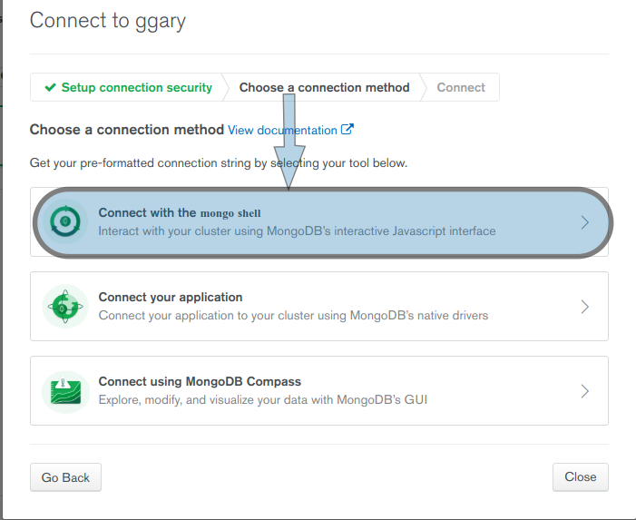
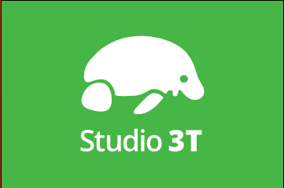
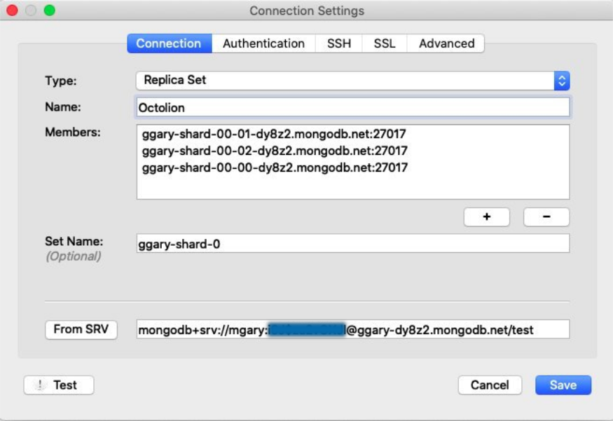

# Ecommerce

## Ramas en git

Estando en la rama master.

```shell
git add .
git commit -m "new rama"
git checkout -b newRama
git push origin newRama
git checkout master
git push origin master
```

### 01BasicStructure

Estructura básica de un proyecto en NodeJS, Express, Template engine (Pug) y MongoDB.

#### Comandos:

```shell
mkdir ecommerce
cd ecommerce
npm init -y
npm i -S express
npm i -S pug
npm i -D nodemon
```

#### Archivos añadidos:

- package.`json`
- index.`js`
- .`gitignore`
- avance.`md`

#### Archivos acualizados:

- index.`js`
- package.`json`

---

### 02PugTemplateEngine

Usando Pug como Template Engine.

#### Archivos añadidos:

- ./routes/products.`js`
- ./views/products.`pug`

#### Archivos acualizados:

- index.`js`

---

### 03ImplementBulmaInPug

Implementando el framework Bulma en el Template Engine "Pug".

Bulma solo tiene CSS, lo que lo hace muy liviano a comparación de Bootstrap.

#### Archivos añadidos:

- ./views/footer.`pug`
- ./views/navbar.`pug`
- ./views/layout.`pug`

#### Archivos acualizados:

- ./views/products.`pug`

---

### 04StaticFiles

Implementando archivos estáticos.

#### Archivos añadidos:

- ./public/assets/main.`css`
- ./public/images/hero-bg.`jpg`
- ./public/logo/octolion-white@2x.`png`
- ./public/logo/octolion@2x.`png`
- ./public/favicon.`png`

#### Archivos acualizados:

- index.`js`
- ./views/layout.`pug`
- ./views/products.`pug`
- ./views/footer.`pug`
- ./views/navbar.`pug`

---

### 05API_REST-FULL

Implementando la anatomía para una API REST-FULL.

REST, estilo de arquitectura para Web services, no es un estandar pero si existe una especificación por Roy Fielding cofundador de Apache, HTTP Server y el director de Apache Software Fundation, y actualmente trabaja para Abode. Consiste en el envío y recivimiento de archivos `json` y `XML`, utiliza HTTP Verbs explícitamente (GET, POST, DELETE, etc...), también tiene un patrón de URI y está basado en directorios para las rutas.


#### Archivos añadidos:

- ./routes/api/products.`js`
- ./utils/mocks/products.`js`

#### Archivos acualizados:

- index.`js`
- ./routes/products.`js`

---

### 06ServiceLayer

Implementando capa de servicio.

Veremos una aquitectura que está basado en MVC.

La arquitectura MVC se quedó corto, autores como Taylor Otwell creador de Laravel, habla de que no es suficiente, MVC debería ser llamado: Separación de Problemas.

Nuestro "Modelo" es parte del paquete "Librerías", este paquete es básicamente el que se encarga de conectarse con librerías externas, es decir: Base de datos, Base de datos de otros servicios, y otras APIs. La "Vista" realmente está representada por los datos que enviamos o recivimos que nos envía el "Controlador", la función de este "Controlador" es simplemente recivir y enviar datos a la "Vista". En éste caso nuestro "Controlador" está representado por los Middlewares y Router que implementamos, este "Controlador" también se encargan de las API que en este caso reciven y envían JSON. Y los **Servicios** es el corazón de nuestra aplicación, los servicios se encargan, no solo de llamar a las "Librerías", si no llamar a otros **Servicios**, básicamente la **Lógica de Negocios** centra en esta parte.

Explicando el flujo: Sea que reciva una llamada por una ___View___ o un ___API___ el ___Controllers___ recive ésta información y su única tarea es pasarle ésta información a los ___Services___, éstos Servicios deciden que hacer con esto, ya sea llamar a ótros Servicios, si van aplicar una Logica de Negocios, si van aplicar Reglas de Seguridad, etc., y cuándo yá tengan claro eso, ésos Servicios llaman a las ___Libraries (Lib)___, la lógica que deberían tener las Librerías es exclusívamente para el consumo de Datos, puede que llame a las Librerías de MongoDB, en Firebase, ó para llamar a otra API que séa posible. Ésto es básicamente la arquitectura.


#### Comandos:

```shell
npm i -S body-parser
```

Para desinstalar una librería de nuestro package.`json`.

```shell
npm uninstall -S body-parse
```

#### Archivos añadidos:

- ./services/products.`js`

#### Archivos acualizados:

- ./routes/api/products.`js`
- ./routes/products.`js`
- index.`js`

---

### 07RecappingTheProject

Recapitulando el proyecto, cambiamos la estructura del proyecto y añadimos comentarios.

#### Archivos acualizados:

- index.`js`
- ./routes/views/products.`js`
- ./routes/api/products.`js`

---

### 08MongoDBconnectionExpress

Cómo conectarse a una instancia de MongoDB usando `mLab`, es un servicio de base de datos que nos ofrece conexiones a MongoDB, para ello lo que tenemos que hacer es:

* Crear una Cuenta.
* Crear una Base de Datos.
* Crear un usuario.

Es importante que las credenciales de la cuenta de `mLab` las creemos usando aplicativos como LastPass o 1Password.

Es importante que nuestro archivo `.env` no exista en nuestro repositorio de `github`, porque ahí tendremos toda la información necesaria, para conectarnos a nuestra `BD`.

Actualmente `mlab` es parte de `MongoDB`, así que con nuestras credenciales ya creadas accedemos a `mongodb.com`, una vez dentro creamos un Cluster gratuino, cambiamos el nombre `Cluster0` por cualquiera, en mi caso será `ggary`.

#### Configurando nuestro Cluster

1. `Crear usuario`, en la parte del menú, accedemos a `Security->Database Access`, agregamos un nuevo usuario de la `BD`, en mi caso el usuario es `mgary`, estas credenciales lo usaremos en el archivo `.env`.

2. `IP Address`, en la parte del menú, accedemos a `Security->Network Access`, añadimos un `IP Address`, pulsamos `ADD CURRENT IP ADDRESS`, nos genera una IP `0.0.0.0/0`, por medio de esta lista de IP Addresses accedemos a nuestro Cluster.

3. `BD`, en la parte del menú, accedemos a `Atlas->Clusters`, nos aparecerá una lista de nuestros Clusters, en la que creamos precionamos `COLLECTIONS`, y creamos nuestra base de datos, para este proyecto será `octolion`, con la colección `products`.

#### Conectarse a nuestra `BD` del Cluster

* Conectarse por `mongo shell`, en mi caso la versión `4.2.5`.





Mi cadena de coneccción: `mongo "mongodb+srv://ggary-dy8z2.mongodb.net/test"  --username mgary`.


Ingresamos la contraseña de nuestro usuario de la `BD`.


Mostramos las `BD`.


* Conectarse por Studio 3T:




Al copiar la cadena de conección: `mongodb+srv://mgary:<password>@ggary-dy8z2.mongodb.net/test`.

Añadimos la contraseña del usuario `ggary` y pegamos en Studio 3T: `New Connection->From URI...`.


No olvidemos cambiar por la contraseña correcta.


Todos estos datos anteriores debería hallar por defecto, una vez terminado, precionamos en `Test Connection` para asegurarnos que la conección tiene éxito.


Como la conección fue exitosa nos muestra las `BD` de nuestro Cloud.


* Conectarse por Robo 3T:


Editamos `Name`, en nuestro caso pondré `Octolion`.




* Conectarse por MongoDB Compass:


No olvidemos cambiar la contraseña.


---

### 09ServicesWithMongoDB

Creamos un archivo de configuración `.env.example` para que el desarrollador cree su propio archivo `.env` lo cual no debe ser añadido al repositorio, luego realizamos la conección a nuestro mongoDB de nuestro Cloud, por último comprobamos listando la colección de `products`.

#### Comandos:

```shell
npm i -S dotenv
npm i -S mongodb
```

#### Archivos añadidos:

- ./.`env.example`
- ./.`env`
- ./config/index.`js`
- ./lig/mongo.`js`

#### Archivos acualizados:

- ./avance.`md`
- ./.`gitignore`
- ./services/products.`js`

### 10ImplementingCRUD

Implementamos acciones CRUD de mongo DB y lo utilizamos en nuetro servicio, para realizar la prueba utilizamos `postman`.


#### Archivos acualizados:

- ./avance.`md`
- ./lib/mongo.`js`
- ./services/products.`js`

### 11Middleware

Es nada más una función, que tiene tiene tres argumentos:

* El `request` object
* El `response` object
* Y un Callback llamado `next`, que cuando se invoca llama al siguiente middleware.

Piensen en un middleware como una serie de capas en un `request`.

#### ¿Para que sirve?

Para hacer modificaciones al `request` y al `response` object, podemos hacer cosas como validaciones, manejo de errores, etc...

Pero lo más importante del middleware es, siempre llamar a la función `next()`


#### Tipos de Middleware


>Ejemplos de cada uno, respectivamente.

* Body-parser: cuando lo agregamos a nuestra aplicación, lo que hace es: interceptar el `request` verificar que tenga un cuerpo (`Body`) y si necesita ser formateado a `json`, y aplicar lo necesario para que funcione.

* Router aplicadas a nuestras API o a nuestras Vistas "`routes/api`" "`routes/views`".

* Express-static, por que se usa con `app.use()`.

* Integrados con Express.

* Lo veremos en el siguiente apartado.

#### Archivos acualizados:

- ./avance.`md`
